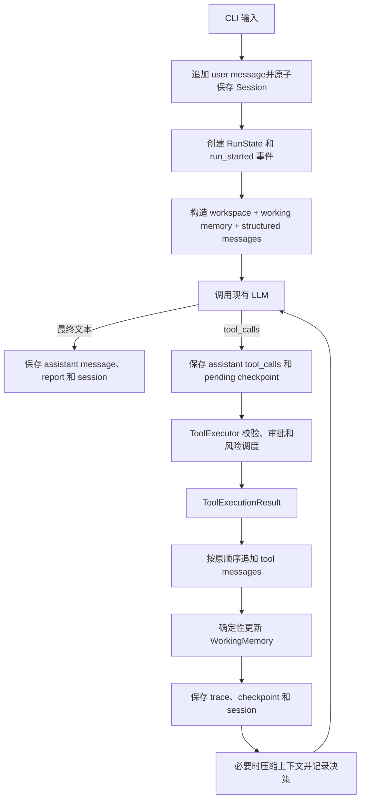

# PikaCore 详细设计方案

> 文档状态：V1 实施基线
>
> 上游项目：CoreCoder 0.4.x
>
> 项目名称：PikaCore
>
> 目标：在保留 CoreCoder 简洁主循环的前提下，把它演进成安全、可恢复、可观测、可评估的 coding agent harness。

## 一、范围和关键决策

### 1. V1 要解决什么

PikaCore V1 不是重新发明模型协议，也不是堆叠 provider 数量。它集中解决模型调用外围的
harness 问题：

1. 工具执行是否越出工作区、是否需要审批、多个调用应如何调度；
2. 一次任务做了什么、为什么停止、失败后留下了哪些证据；
3. 中断后能否安全恢复，而不是盲目重放可能已经产生副作用的操作；
4. 上下文压缩后，当前目标、关键文件、最近错误是否仍然保留；
5. working memory 是否准确、可失效、可测试；
6. 新增 harness 后，任务成功率、安全性和开销是否可以用固定 benchmark 衡量。

### 2. V1 明确不做什么

以下内容不进入 V1：

- 不做 durable memory，不创建跨项目知识库，不引入 embedding 或向量数据库；
- 不新增 provider，不新增 Anthropic Messages、Responses API 或其他 HTTP client；
- 不实现自定义 prompt cache，不增加 cache key、breakpoint 或 provider-specific 缓存逻辑；
- 不引入 LangGraph、Swarm 等 agent/workflow 框架；
- 不改掉 CoreCoder 的原生 function calling；
- 不把 structured messages 改成 `<tool>` 文本协议；
- 不实现真正的 OS sandbox。V1 的路径限制、审批和命令检查是护栏，不应宣传成沙箱；
- 不做 Web UI、IDE 插件和远程任务平台。

CoreCoder 现有 OpenAI-compatible provider、流式文本、tool call 拼接和上下文行为继续使用。
缓存优化只保留一个设计原则：**稳定内容在前，动态状态作为新消息追加**。V1 不增加新的
缓存代码，也不把缓存命中列为完成条件。

### 3. 产品命名与兼容策略

PikaCore 是一个保留 Git 历史的 CoreCoder fork。V1 采用一次独立的机械重命名提交：

- GitHub repository：`PikaCore`；
- Python package：`pikacore`；
- CLI command：`pikacore`；
- 项目状态目录：`.pikacore/`；
- 用户级终端历史：`~/.pikacore_history`；
- 新环境变量前缀：`PIKACORE_`；
- `OPENAI_API_KEY` 和 `OPENAI_BASE_URL` 保持不变；
- V1 对旧 `CORECODER_*` 配置提供 fallback，并在帮助文本中标为兼容项；
- 版本从 `0.1.0` 开始，README 明确写明 fork 来源；
- 保留上游 MIT License 和原作者版权声明，可另加 PikaCore 修改说明，不删除原声明。

重命名应只做标识替换和兼容入口，不和功能改造放进同一个 commit。

## 二、架构总览

### 1. 不变的主链路

PikaCore 继续使用 CoreCoder 的模型交互方式：

```text
structured messages + tool schemas
              |
              v
OpenAI-compatible Chat Completions API
              |
              v
text delta 或原生 tool_calls
```

LLM 仍然负责选择工具和生成参数；本地 harness 决定工具能否执行、如何调度、记录什么。

### 2. 新的运行链路



### 3. 责任边界

| 层 | 负责 | 不负责 |
|---|---|---|
| CLI | 参数、交互输入、渲染、本地 `/command` | 直接写 session JSON、直接执行工具 |
| Agent | model/tool loop、消息协议不变量、轮数上限 | 路径安全规则、终端审批细节 |
| ToolExecutor | 工具查找、参数校验、审批、调度、异常归一化 | 决定模型下一步做什么 |
| Workspace | repo root、路径边界、动态工作区状态 | 执行 shell |
| State/Store | session、run、trace、checkpoint、report 的持久化 | 修改模型消息语义 |
| WorkingMemory | 当前任务的短期事实和 freshness | 跨 session 的长期知识 |
| ContextManager | token 预算、裁剪、摘要、协议合法性 | provider-specific prompt cache |
| Evaluation | fixture、FakeLLM、指标和回归报告 | 生产会话状态 |

## 三、建议目录结构

保持上游的平铺 Python package，不切换成 `src/` layout，以减少无关改动：

```text
PikaCore/
├── pikacore/
│   ├── __init__.py
│   ├── __main__.py
│   ├── agent.py
│   ├── cli.py
│   ├── commands.py             # CLI 命令路由，只读取/调用底层能力
│   ├── config.py
│   ├── context.py
│   ├── llm.py                  # V1 延用 CoreCoder provider
│   ├── prompt.py
│   ├── state.py                # SessionState/RunState/TraceEvent 等 dataclass
│   ├── store.py                # 原子 JSON、JSONL 和工件目录
│   ├── workspace.py            # repo root、路径边界、状态和 freshness
│   ├── permissions.py          # 权限模式、risk 决策、审批结果
│   ├── security.py             # env allowlist、secret 检测、递归脱敏
│   ├── tool_executor.py        # 统一执行入口和 barrier 调度
│   ├── checkpoint.py           # 恢复有效性分类
│   ├── working_memory.py       # 确定性短期记忆更新
│   ├── session.py              # 兼容门面，逐步委托给 store/state
│   └── tools/
├── tests/
│   ├── unit/
│   ├── integration/
│   └── fixtures/
├── benchmarks/
│   ├── tasks/
│   ├── repos/
│   └── run_benchmarks.py
├── docs/
│   └── PIKACORE_DESIGN.md
├── AGENTS.md                   # Codex 仓库级开发约束
├── .gitignore
├── LICENSE
├── README.md
├── pyproject.toml
└── uv.lock                     # 提交到 Git 的跨平台依赖锁文件
```

不要一开始就移动全部旧测试。每个阶段只把相关测试迁入 `unit/` 或 `integration/`；旧测试
在迁移完成前继续保留，避免一次大搬家掩盖行为变化。

运行时状态放在当前 repo root，而不是用户家目录：

```text
.pikacore/
├── sessions/<session_id>.json
├── runs/<run_id>/task_state.json
├── runs/<run_id>/trace.jsonl
├── runs/<run_id>/report.json
├── checkpoints/<checkpoint_id>.json
└── evals/<evaluation_id>/report.json
```

`.pikacore/` 必须进入 `.gitignore`。状态文件不得保存 API key、完整环境变量或未脱敏的
敏感工具输出。

## 四、必须保持的核心契约

功能开发前，先把以下行为写成回归测试：

1. 每个 assistant `tool_call.id` 最终都有且只有一条相同 id 的 tool message；
2. tool messages 的回填顺序与模型返回的 tool call 顺序一致；
3. 参数错误和工具内部异常都成为模型可读的 tool result，不让 Agent 进程崩溃；
4. Ctrl+C 或恢复不留下 orphan tool call；
5. `on_token` 仍可流式输出，最终完整 assistant message 仍写入历史；
6. context 压缩不会切断 assistant tool_calls 与 tool replies；
7. 每个 Agent 只使用自己的实例级工具表；
8. 子 Agent 不获得 `agent` 工具，不能递归创建孙 Agent；
9. `max_rounds` 行为保持不变；
10. 没有启用新 harness 依赖时，FakeLLM 单元测试不需要真实 API。

这些测试是 PikaCore 的协议层安全网。后续模块可以改变内部结构，但不能改变这些结果。

## 五、核心数据模型

所有持久化对象包含 `schema_version`。V1 使用整数版本 `1`，读取未知更高版本时返回
`schema-mismatch`，不要猜测解析。

### 1. ToolExecutionResult

```python
@dataclass
class ToolExecutionResult:
    tool_call_id: str
    tool_name: str
    content: str
    status: Literal["ok", "error", "rejected", "partial"]
    error_code: str | None = None
    duration_ms: int = 0
    read_paths: list[str] = field(default_factory=list)
    affected_paths: list[str] = field(default_factory=list)
    workspace_changed: bool = False
    exit_code: int | None = None
    output_truncated: bool = False
    approval: Literal["not_required", "approved", "rejected"] = "not_required"
```

`content` 回填给 LLM；其余 metadata 进入 trace、working memory 和 report。不要把内部
metadata 全部序列化进 tool message，否则会增加上下文并暴露不必要状态。

### 2. WorkingMemory

```python
@dataclass
class FileMemory:
    path: str
    action: Literal["read", "modified"]
    summary: str
    content_hash: str | None
    fresh: bool
    updated_at: str


@dataclass
class CommandMemory:
    command: str
    exit_code: int | None
    status: str
    run_id: str
    executed_at: str


@dataclass
class WorkingMemory:
    current_request: str
    task_summary: str
    files: list[FileMemory]
    recent_commands: list[CommandMemory]
    blockers: list[str]
    next_steps: list[str]
    updated_at: str
```

V1 不允许模型自由写入 WorkingMemory。更新规则必须是确定性的：

- 新 user message 替换 `current_request`，并将截断后的请求作为初始 `task_summary`；
- `read_file` 成功后记录 path、内容摘要和 hash；
- `write_file`/`edit_file` 成功后将 path 标为 `modified`，旧摘要立即标记 `fresh=False`；
- Bash 执行后记录命令、exit code 和状态，只保留最近 10 条；
- tool error、审批拒绝和恢复冲突进入 blockers；
- `next_steps` 只来自 checkpoint 的确定性状态，例如“重新读取已过期文件”，不解析模型
  自由文本中的承诺；
- files 最多保留 30 项，blockers 和 next_steps 各最多 10 项；
- 新 session 初始化为空；同一 session 内持续存在；`/reset` 是否清空 memory 必须显式提示。

这就是“只做 Working Memory”的边界：它帮助当前会话继续任务，但不写入跨 session 的
长期事实，不做检索，也没有 `remember` 工具。

### 3. SessionState

```python
@dataclass
class SessionState:
    schema_version: int
    session_id: str
    created_at: str
    updated_at: str
    repo_root: str
    model: str
    messages: list[dict]
    working_memory: WorkingMemory
    last_checkpoint_id: str | None
    run_ids: list[str]
```

Session 表示跨多次 user request 的连续会话。API key、base URL 和 permissions 不作为秘密
值写入；恢复需要的非敏感 runtime identity 写在 checkpoint 中。

### 4. RunState 与 Report

```python
@dataclass
class RunState:
    schema_version: int
    run_id: str
    session_id: str
    user_request: str
    status: Literal["running", "completed", "failed", "interrupted"]
    stop_reason: str | None
    started_at: str
    finished_at: str | None
    model_attempts: int
    tool_steps: int
    final_answer: str | None
    error: str | None
```

`stop_reason` 使用稳定枚举：`completed`、`max_rounds`、`user_interrupted`、
`tool_rejected`、`model_error`、`internal_error`。Report 在 run 结束时汇总：

- run/session/model；
- wall time、model attempts、tool steps；
- prompt/completion token 增量；
- 各工具调用次数、错误次数和审批次数；
- 读取/修改的文件；
- context compression 次数和前后估算 token；
- checkpoint/recovery 状态；
- stop reason 和是否完成。

### 5. TraceEvent

```python
@dataclass
class TraceEvent:
    schema_version: int
    seq: int
    timestamp: str
    event: str
    session_id: str
    run_id: str
    data: dict
```

V1 事件集合固定为：

```text
run_started
message_appended
context_built
model_requested
model_completed
tool_requested
tool_approved
tool_rejected
tool_completed
working_memory_updated
context_compressed
checkpoint_created
run_finished
run_failed
```

不记录每个 streaming token。`data` 进入 JSONL 前必须递归脱敏并限制字符串长度。trace
允许最后一行因进程崩溃而不完整；读取器应忽略损坏的最后一行并报告 warning。

### 6. Checkpoint

```python
@dataclass
class Checkpoint:
    schema_version: int
    checkpoint_id: str
    parent_checkpoint_id: str | None
    session_id: str
    run_id: str
    current_user_request: str
    completed_tool_call_ids: list[str]
    pending_tool_calls: list[dict]
    last_successful_action: str | None
    next_suggested_action: str | None
    file_freshness: dict[str, str]
    runtime_identity: dict
    created_at: str
```

`runtime_identity` 至少包括 model、repo root、branch、tool signature、permission mode 和
harness schema version。它不包含 API key。

## 六、模块详细设计

### 1. Workspace 与路径边界

`WorkspaceContext.discover(start)`：

1. 优先执行 `git rev-parse --show-toplevel`；
2. 非 Git 仓库使用启动目录；
3. 保存 canonical repo root；
4. 读取 branch、`git status --short` 和最近 commit；
5. 不遍历或 hash 整个仓库。

`resolve_path(user_path, for_write=False)` 是所有文件工具的唯一入口：

- 相对路径基于 repo root，不基于进程任意 cwd；
- 允许指向 repo 内部的绝对路径；
- `resolve()` 后必须仍位于 repo root；
- 读取时拒绝指向 repo 外的 symlink；
- 写入不存在文件时，向上找到最近存在的父目录并解析 symlink，再验证最终目标；
- 拒绝 repo root 本身被当作普通文件覆盖；
- 返回 canonical `Path`，工具不再自行重复 `expanduser().resolve()`。

需要明确：Bash 使用 shell，单靠 `cwd=repo_root` 不能阻止访问 repo 外文件。V1 对 Bash
使用审批、环境过滤和 hard deny；真正强隔离属于未来 sandbox 范围。

### 2. Security

`security.py` 提供两个纯函数：

```python
sanitize_environment(source: Mapping[str, str]) -> dict[str, str]
redact(value: Any) -> Any
```

子进程环境变量采用 allowlist：`PATH`、`HOME`、`USER`、`SHELL`、`LANG`、`LC_*`、
`TERM`、`TMPDIR`、`VIRTUAL_ENV`、`PYTHONPATH`。明确排除名称包含 `KEY`、`TOKEN`、
`SECRET`、`PASSWORD`、`CREDENTIAL` 的变量。

`redact()` 递归处理 dict/list/tuple/string：

- key 名命中 secret pattern 时将值替换为 `[REDACTED]`；
- string 中常见 bearer token、API key 和 credential URL 被替换；
- trace 中单个 string 默认最多保存 4000 字符；
- report 默认只保存工具输出摘要，不保存完整 stdout/stderr。

### 3. PermissionPolicy

V1 使用三个无歧义模式：

| 模式 | 只读工具 | 写工具 | Bash/子 Agent |
|---|---|---|---|
| `read-only` | 自动允许 | 拒绝 | 拒绝 |
| `ask` | 自动允许 | 每次询问 | 每次询问 |
| `auto` | 自动允许 | 自动允许 | 自动允许，但 hard deny 仍生效 |

默认是 `ask`。`Tool` 基类增加：

```python
risk_level: Literal["low", "medium", "high"] = "low"
read_only: bool = True
```

内置分类：

- `read_file`、`grep`、`glob`：low + read-only；
- `write_file`、`edit_file`：medium + mutating；
- `bash`：high + mutating；
- `agent`：high + mutating，因为子 Agent 可能间接调用 Bash 或写工具。

审批回调由 CLI 注入，在主线程执行。测试中使用固定返回值的 fake callback，不调用
`input()`。无论权限模式如何，已有危险命令规则和路径边界都不能被跳过。

### 4. ToolExecutor 与调度

Agent 不再直接调用 `tool.execute()`。单个调用流程：

```text
实例级 _tool_by_name 查找
  -> inspect.signature 参数绑定
  -> 工具级路径规范化
  -> PermissionPolicy 决策
  -> CLI 审批（需要时）
  -> 执行并计时
  -> 捕获异常
  -> ToolExecutionResult
  -> redact 后记录 trace
```

多调用调度必须保持模型顺序，同时使用 read-only 并行：

```text
[read A, grep B, edit C, read D, bash E]
      并行批次       串行      单独执行    串行
```

算法：连续 read-only 调用组成 batch 并行执行；每个 mutating/high-risk 调用是 barrier，先
等待前一 batch，再按顺序单独执行；之后重新开始下一个 read-only batch。最终 result 按
原始 index 排序回填。

如果某个写工具被拒绝：

- 生成 status=`rejected` 的 tool result；
- 仍追加对应 tool message，保持协议合法；
- 不自动取消后续独立调用，但同批后续 risky 调用默认停止并标记 rejected-by-barrier；
- 将拒绝写入 blocker 和 trace；
- 模型下一轮可以调整方案。

### 5. Store 与自动持久化

`ProjectStore` 接受显式 `state_root`，测试中指向 `tmp_path`。生产默认
`repo_root/.pikacore`。

JSON 写入统一使用：

1. 同目录创建临时文件；
2. UTF-8 写入并 flush；
3. `os.fsync()`；
4. `os.replace()` 原子替换目标文件。

Session 自动保存点：

- user message 追加后；
- assistant tool_calls 追加后；
- 每个 tool result 追加后；
- context compression 改写历史后；
- final assistant message 追加后；
- 可捕获的 Ctrl+C/异常退出前。

Trace 采用 append-only JSONL，每个事件 flush。Report 和 task_state 使用原子 JSON。

### 6. Checkpoint 与恢复

Checkpoint 在以下位置创建：

1. assistant tool_calls 已保存、工具尚未执行时；
2. 每个 risky 工具完成后；
3. 一批 read-only 工具完成后；
4. context compression 后；
5. run 正常结束时。

恢复验证返回一个明确分类：

| 分类 | 含义 | V1 行为 |
|---|---|---|
| `full-valid` | 文件和 runtime identity 未变 | 正常继续 |
| `files-stale` | 已读/已改关键文件 hash 变化 | 标记摘要失效，要求先重读 |
| `runtime-mismatch` | model、root、branch、tool/permissions 改变 | 追加恢复提醒，不盲目继续 |
| `incomplete-tool-call` | 有 tool call 没有结果 | 补 interrupted tool message，先检查状态 |
| `schema-mismatch` | 无法理解旧状态 | 拒绝自动恢复，保留原文件 |

V1 不自动重放任何 pending tool call。尤其是 write/edit/bash，进程可能在完成副作用后、
保存结果前崩溃。恢复时统一追加：

```text
[interrupted: previous execution state is unknown; inspect workspace before retrying]
```

然后把 stale paths、runtime differences 和 pending tool names 作为新的恢复上下文追加，
由模型先读取 Git diff 或相关文件后再决策。

### 7. Working Memory

`WorkingMemoryManager.apply(event)` 只消费已验证的结构化事件，不直接分析整段对话。示例：

```text
ToolExecutionResult(read_file, ok, read_paths=[agent.py])
  -> 记录 agent.py hash 和截断摘要

ToolExecutionResult(edit_file, ok, affected_paths=[agent.py])
  -> agent.py fresh=False, action=modified

ToolExecutionResult(bash, error, exit_code=1)
  -> recent_commands 追加记录，blockers 追加测试失败
```

传给模型的 working memory 应是短、稳定、确定性的区段，放在 system/tool schema 之后、
messages 之前：

```text
[Working memory]
Task summary: ...
Files:
- pikacore/agent.py [modified, summary stale]
Recent commands:
- pytest tests/unit/test_agent.py -q -> exit 1
Blockers:
- test_interrupt_recovery failed
Next required checks:
- reread pikacore/agent.py
```

`current_request` 用于本地状态和恢复，但渲染给模型时只输出较短的 `task_summary`，
不要把完整请求和最后一条 user message 重复发送。原始请求只在 structured user message
中出现一次。

### 8. ContextManager

保留 CoreCoder 的 `_safe_split()` 和原生 messages。V1 的压缩优先级：

1. 裁剪旧 tool output，保留工具名、路径、exit code、错误尾部和 truncation metadata；
2. 合并重复 read 的旧输出，依靠 WorkingMemory 保留最新文件摘要和 freshness；
3. 用本地规则抽取旧 grep/bash 的关键结果；
4. 仍超过阈值时调用现有 LLM 总结旧合法 turn；
5. 接近硬上限时保留 working memory、恢复提醒、当前请求和最近完整合法 turn。

每次压缩返回 `CompressionResult`：

```python
@dataclass
class CompressionResult:
    changed: bool
    strategy: str | None
    before_tokens: int
    after_tokens: int
    removed_messages: int
    summarized_messages: int
```

Agent 把它写入 trace/report。V1 不实现 prompt-cache 控制，但应遵守缓存友好的排列：

```text
稳定：system rules + tool schemas
半稳定：repo root + project instructions
动态：working memory + recovery/workspace notice
追加：structured messages + current user message
```

工具 schema 顺序保持确定性；普通文件变化通过新 notice 或 working-memory 更新表达，不
回头修改旧 tool result。发生 compaction 后接受 conversation prefix 重新建立这一事实。

### 9. Agent 集成

`Agent.chat()` 不应一次重写。按下面顺序逐步接入：

1. 用 `_append_message(message)` 替换散落的 `messages.append()`，集中持久化和事件记录；
2. 用 ToolExecutor 替换 `_exec_tool()` 内部逻辑，保留兼容方法供旧测试调用；
3. 每次 chat 创建 RunState，并在所有 return/exception 路径设置 stop reason；
4. tool result 后更新 WorkingMemory 和 checkpoint；
5. context compression 读取 WorkingMemory，并返回 CompressionResult；
6. 子 Agent 使用新的独立 SessionState，但继承 workspace 和 permission policy；
7. 子 Agent 不写主 session，其最终结果作为主 Agent 的一个 tool result；
8. 子 Agent 的 trace 使用独立 run id，并通过 `parent_run_id` 关联。

Agent 仍只从 `self._tool_by_name` 查找工具，不退回全局注册表。

### 10. CLI 命令

CLI 在底层状态模块完成后再增加。将 `/command` 路由移到 `commands.py`，避免继续扩张
`cli.py` 的 if/elif 链。命令只是状态能力的视图，不得自己解析 JSON 或修改内部字段。

保留并测试：

- `/tokens`：当前 session 累计 token/cost；
- `/model [name]`：查看或切换模型，切换后更新 runtime identity；
- `/compact`：通过 Agent API 手动压缩，同时写 trace 和保存 session；
- `/diff`：显示本 session 修改路径，优先来自 ToolExecutionResult；
- `/save [name]`：保留为当前 session 的命名快照；
- `/sessions`：保留为 `/session list` 的兼容别名。

新增：

| 命令 | 行为 |
|---|---|
| `/memory` | 展示 WorkingMemory 摘要 |
| `/memory files` | 展示文件、freshness 和最近 action |
| `/memory clear` | 二次确认后清空当前 working memory，不改 messages |
| `/session` | 当前 session id、repo、model、message/run 数和保存时间 |
| `/session list` | 最近 session |
| `/session new` | 保存当前 session 后创建新 session |
| `/session resume <id>` | 验证 checkpoint 后切换 session |
| `/runs [n]` | 当前 session 最近 n 个 run，默认 10 |
| `/trace [run_id] [n]` | 最近 n 条脱敏事件，默认当前 run、20 条 |
| `/permissions` | 展示当前模式和工具风险表 |
| `/permissions read-only\|ask\|auto` | 修改当前进程权限模式并写 trace |

CLI 参数新增 `--permissions read-only|ask|auto`，默认 `ask`。现有 `-r/--resume` 保留。

### 11. Evaluation Harness

最小 benchmark 使用 fixture repo 和 ScriptedFakeLLM，不消耗真实 API：

| ID | 场景 | 成功条件 |
|---|---|---|
| `edit-basic` | 读取并精确修改文件 | diff 正确，测试通过 |
| `bad-args-retry` | 第一次 tool args 缺失 | error 回填后第二次成功 |
| `path-escape` | 读取/写入 `../` 或外部 symlink | ToolExecutor 拒绝 |
| `permission-reject` | ask 模式拒绝 edit | 无文件变化，tool pairing 合法 |
| `parallel-read` | 同轮多个 read/grep | 并行且回填顺序正确 |
| `write-barrier` | read/write/read 混合调用 | 写操作串行，顺序确定 |
| `large-output` | Bash/grep 产生大输出 | 压缩后仍完成，trace 可解释 |
| `resume-stale-file` | 保存后外部修改文件 | 恢复分类为 files-stale |
| `resume-unknown-write` | 写工具完成前中断 | 不自动重放，先检查工作区 |
| `working-memory-stale` | read 后 edit 同一文件 | 旧摘要 fresh=False |

每个 benchmark 生成 JSON：完成率、耗时、model attempts、tool steps、token、审批次数、
压缩次数、恢复分类和失败类别。

V1 只做两个有意义的 ablation：

- Working Memory on/off；
- 新的分层压缩策略 on/off。

不要做 provider 或 prompt-cache ablation，因为 V1 没有实现这些扩展。

## 七、端到端时序

一次正常请求：

1. CLI 将输入交给 `Agent.chat()`；
2. 创建 run，写 `run_started`；
3. append user message，原子保存 session；
4. WorkingMemory 更新 current request；
5. ContextManager 计算预算，必要时压缩并记录；
6. 写 `model_requested`，调用现有 LLM；
7. 若是 tool calls，先 append assistant message 并保存 pending checkpoint；
8. ToolExecutor 按 barrier 规则执行；
9. 每个 result 按原顺序 append tool message；
10. 更新 WorkingMemory、workspace dynamic state、trace、checkpoint 和 session；
11. 回到步骤 5；
12. 若是最终文本，append assistant message；
13. 完成 RunState、Report、final checkpoint 和 session；
14. CLI 渲染最终结果。

异常路径必须在 `finally` 中完成可完成的持久化。持久化失败不能伪装成任务成功：至少在
终端显示 warning，并在 report 可写时记录 `persistence_error`。

## 八、实施阶段和提交顺序

每个阶段或子阶段使用独立 branch/PR，先测试后实现，不跨阶段偷跑。

### Phase 0：建立 PikaCore 身份

改动：package/CLI/env/state-dir/README/pyproject/CI 路径重命名，保留 MIT attribution 和
旧 env fallback；更新 `.gitignore` 以排除 `.pikacore/` 和 `.pikacore_history`；重新生成
并提交 `uv.lock`，不要将 lockfile 加入 `.gitignore`。CI 使用 lockfile 安装依赖；在
`pyproject.toml` 中显式固定当前 Ruff 基线规则，避免工具升级悄悄改变 lint 范围。上游
PyPI publish workflow 在 PikaCore 配置独立发布身份前移除或禁用，GitHub Release 不得
误触发 CoreCoder 的发布流程。

提交建议：

```text
chore: establish PikaCore project identity
```

完成标准：`pikacore --version`、top-level imports、全部旧测试通过。

### Phase 1：锁定协议契约

改动：补齐 tool pairing、parallel ordering、interrupt、streaming、instance scope、
max-rounds 回归测试；此阶段不改生产行为。

```text
test: lock down agent loop protocol invariants
```

### Phase 2：Workspace、Security、Permissions、ToolExecutor

先实现 path guard 和结构化 result，再实现审批和 barrier 调度。

```text
feat: add workspace-scoped tool execution
feat: add permission policy and sanitized shell environment
feat: schedule mutating tool calls behind execution barriers
```

### Phase 3：Session、Run、Trace、Report

实现 schema、ProjectStore、原子写入、自动保存和脱敏事件。

```text
feat: persist sessions and per-run artifacts
```

### Phase 4：Checkpoint 与恢复验证

实现 runtime identity、freshness、恢复分类和 incomplete-call 修复，不自动重放工具。

```text
feat: validate checkpoints before session recovery
```

### Phase 5：Working Memory 与 Context

只实现确定性 working memory，再把 freshness 和压缩 metadata 接进 ContextManager。

```text
feat: add structured working memory
feat: record context compression decisions
```

### Phase 6：Evaluation Harness

实现 10 个 fixture benchmark、JSON report 和 working-memory/context ablation。

```text
test: add reproducible harness benchmarks
```

### Phase 7：CLI 状态窗口

最后增加 `/memory`、`/session`、`/runs`、`/trace`、`/permissions`，并保留原命令。

```text
feat: expose harness state through CLI commands
```

### Phase 8：文档和首个版本

补架构图、威胁边界、演示、benchmark 结果和迁移说明，发布 `v0.1.0`。

```text
docs: document PikaCore architecture and evaluation results
```

## 九、测试策略

### 1. 每个阶段都运行

```bash
uv lock --check
uv run --extra dev ruff check .
uv run --extra dev pytest tests/ -q
uv run python -m compileall pikacore
```

### 2. 单元测试重点

- dataclass JSON round-trip 和 schema mismatch；
- path traversal、absolute path、symlink escape、nonexistent write parent；
- recursive redaction 和 shell env allowlist；
- permission 三模式决策；
- barrier 分组和结果排序；
- atomic write 遇到异常不破坏旧文件；
- WorkingMemory 上限、去重和 stale invalidation；
- compression result 指标；
- trace 损坏末行读取；
- CLI command parsing 不触发真实 API。

### 3. 集成测试重点

- FakeLLM 的 read -> edit -> test -> final 全链路；
- 中断发生在 assistant tool_calls 保存后；
- 中断发生在写工具产生副作用但 result 未保存时；
- 恢复时 branch/model/permission 改变；
- 多工具 read/write barrier；
- 子 Agent 的权限继承、tool scope 和 parent_run_id；
- context 压缩后 provider 协议仍合法；
- 自动 session JSON 在每个 durability boundary 都可读取。

### 4. 真实 API smoke test

单元和集成测试不能依赖真实 API。每个 release 候选只运行一个人工 smoke test：

```text
读取一个 fixture 文件 -> 做一处编辑 -> 运行 fixture 测试 -> 返回总结
```

执行前确认使用测试仓库、`ask` permissions 和受控额度。真实 token/cost 只作为报告，不
作为测试断言。

## 十、风险与取舍

1. **路径护栏不是 Bash 沙箱。** README 必须明确说明，不能声称任意 shell 命令已隔离。
2. **Working Memory 可能过期。** freshness 是核心字段；未知状态宁可标 stale，不保留假
   摘要。
3. **自动持久化增加 I/O。** 先保证正确性，性能有数据后再优化，不用后台线程隐藏错误。
4. **trace 可能泄密。** 所有事件统一经过 redact，禁止模块自行随意 dump 对象。
5. **compaction 会改变缓存前缀。** V1 接受这一点，不为缓存牺牲恢复和上下文正确性。
6. **机械重命名影响上游合并。** 把 rename 隔离成一个 commit，后续同步上游时更容易定位
   冲突。
7. **CLI 容易反向驱动架构。** 命令最后实现，只调用稳定底层 API。
8. **状态 schema 会演进。** 从第一天带 version，未知版本 fail closed。

## 十一、V1 完成定义

满足以下全部条件才算 PikaCore V1 完成：

- CoreCoder 原生 function-calling、streaming 和工具协议没有退化；
- 文件工具不能通过 `..`、绝对路径或 symlink 逃出 workspace；
- `ask` 模式下所有写工具、Bash 和子 Agent 都经过主线程审批；
- read-only 工具可并行，mutating 工具按 barrier 串行；
- 每个 user request 都产生合法 task_state、脱敏 trace 和 report；
- session 在关键边界自动原子保存，崩溃后 JSON 仍合法；
- 恢复能够区分 valid、stale、runtime mismatch、incomplete 和 schema mismatch；
- 未知状态的 write/edit/bash 不会自动重放；
- WorkingMemory 只包含当前会话短期状态，文件变化会使旧摘要失效；
- 没有 durable memory、额外 provider 或新 prompt-cache 实现；
- 10 个固定 benchmark 可重复运行并生成机器可读报告；
- `/memory`、`/session`、`/runs`、`/trace`、`/permissions` 可用；
- `/tokens`、`/model`、`/compact`、`/diff` 继续可用；
- ruff、pytest、compileall 全部通过；
- `uv.lock` 已提交且 `uv lock --check` 通过；
- README 清楚标注 fork 来源、MIT attribution、安全边界和 benchmark 方法。

## 十二、V1 之后再考虑的内容

只有在 V1 有真实使用数据后，才重新评估：

- durable memory 和显式 `remember` 工具；
- Responses/Anthropic 等 provider adapter；
- provider-specific prompt cache 和 cached-token benchmark；
- OS sandbox、容器或远程隔离执行；
- IDE/Web UI；
- 更复杂的 planner、workflow 或多 Agent 协调。

这些不是 V1 的“遗漏”，而是刻意延后的设计空间。
